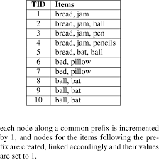
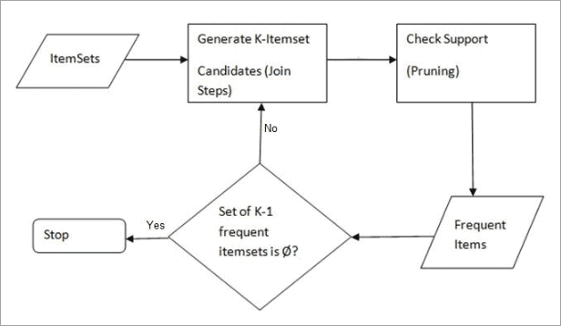
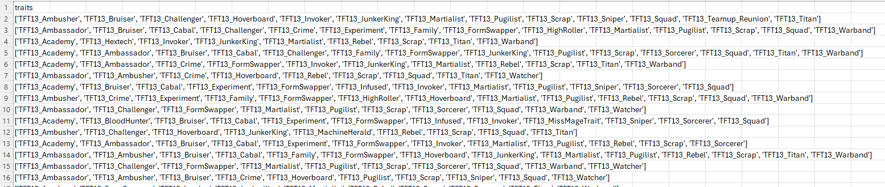

<a href = "https://wihi1131.github.io/Machine-Learning-Project/">Home</a>

# Overview

ARM is short for Association Rule Mining. This is a widely-used method for finding unique patterns or associations between items in large transactional datasets, such as data from what customers purchased at a store. For example, a use case of ARM might be to find if there is any support for the claim that, if a customer buys milk at a store, that they will also buy bread. 

Rules are discovered truths about the dataset in question. They are typically written X → Y, where X and Y are different itemsets. The rule above would indicate that a customer who bought item X is likely to buy item Y. The threshold for determining whether a likelihood becomes a rule is arbitrarily chosen. 

Support is a measurement used in ARM, representing how likely it is that an item will be found in the dataset. For example, a support for X of 40% means that 40% of all transactions in the dataset contain item X. 

Confidence is used to describe rules, and gives the probability that a transaction containing X will also contain Y. Mathematically, it is described as follows: 

confidence(X → Y) = {support(X U Y)}/{support(X)}

If confidence is high, then there is a high likelihood of finding Y where we find X. 

Lift is a measurement, again, describing rules, that measures how much more likely it is that transactions that contain X will contain Y compared to a random transaction in the dataset. Mathematically, it is described as follows: 

lift(X → Y) = {support(X U Y)}/{support(X) * support(Y)}

A lift greater than 1 indicates that X and Y appear more often than it would be expected that they would appear together if they had no relation to each other. A lift less than 1 indicates the opposite; that X and Y appear together less often than would be expected. A lift equal to 1 indicates that there is no relationship between X and Y. 

The Apriori algorithm is a way to conduct frequent itemset mining. This is the first step before finding interesting rules. It works by finding all unique items in a dataset, then checking which of these meet a minimum support threshold (arbitrarily determined). We designate these as frequent-1-itemsets. From these, we generate candidate k-itemsets from the (k-1)-itemsets. For example, if {milk} and {bread} are both frequent-1-itemsets, then we would combine them to form a candidate 2-itemset {milk, bread}. 

We then use the principle called the Downward Closure Property, that states that all non-empty subsets of a frequent itemset must also be frequent. This means that if {milk, bread} is frequent, then {milk} and {bread} must also be frequent. If, for example, {milk} is not found to be frequent, then checking {milk, bread} is unnecessary. We use this property to prune our options by deliberately not checking any itemsets that could not, by the Downward Closure Property, be frequent. 

For each candidate k-itemset, we scan the entire dataset to count the number of transactions containing this set. Any candidate k-itemset that does not meet the arbitrarily defined minimum support threshold is pruned and discarded. For every iteration of the algorithm, k increases by 1. The algorithm stops when no candidates meet the minimum support threshold and no more frequent k-itemsets can be found. 

From each frequent itemset that the algorithm finds, we create rules. For example, if {milk, bread} is frequent, we consider rules such as {milk} → {bread} and {bread} → {milk}, as long as they meet the minimum confidence threshold. 

  
  

    

      <b>This image shows an example of a transactional dataset</b>
    

  

  
  

    

      <b>This is an image detailing the steps of the Apriori algorithm described above.</b>
    

  

# Data Prep

As explained above, transactional data only shows items that were purchased in a single transaction, without including item quantities or any other information. In the case of this project, fortunately the number of active traits used by a player in a particular game can be transformed into transaction data. We can then perform ARM on this data to find if there are any traits that are frequently used together by players. 

Below is a snippet of our trait data transformed into transactional data. 

  
  

    

      <b>This is an image showing a snippet of transactional trait data. Every "transaction" is the traits used by one player in a particular game.The full dataset can be found here: <a href = "https://github.com/WiHi1131/Machine-Learning-Project/blob/main/data/trait_transactions.csv">Data</a></b>
    

  

# ARM Code Found Here: <a href = "https://github.com/WiHi1131/Machine-Learning-Project/blob/main/code/ARM.ipynb">Code</a>

<a href = "https://wihi1131.github.io/Machine-Learning-Project/">Home</a>
