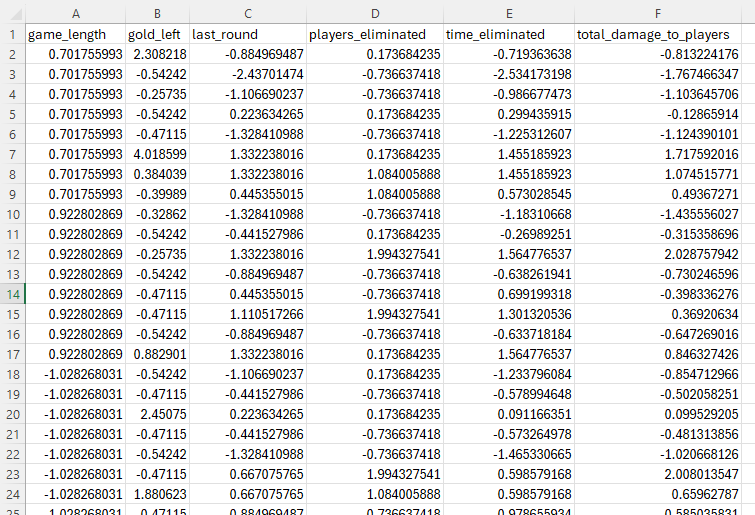
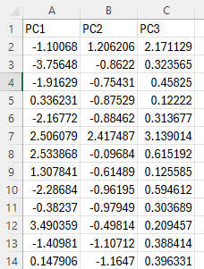
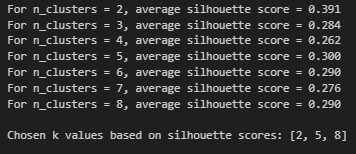
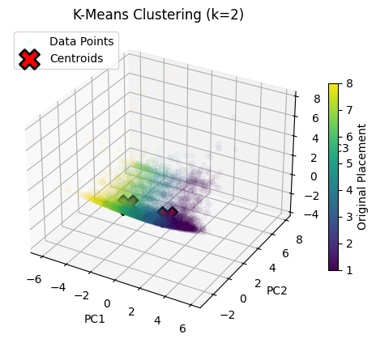
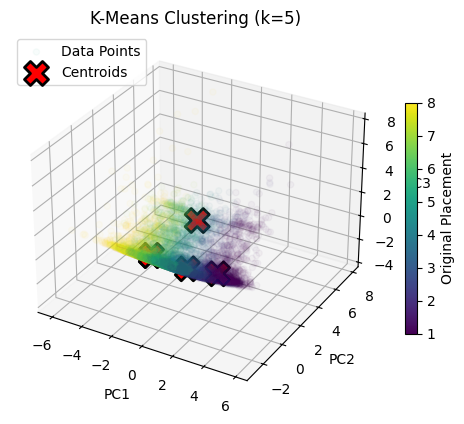
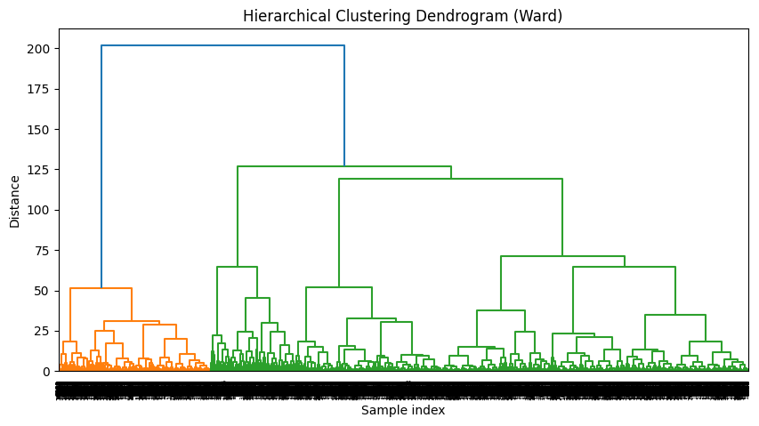

<a href = "https://wihi1131.github.io/Machine-Learning-Project/">Home</a>

# Comparison of Clustering Algorithms

Many types of clustering algorithms are available within Python's sklearn library. Below is a comparison of three types of clustering algorithms: K-means, Hierarchical clustering, and DBSCAN (density) clustering: 

- K-Means: The basic idea of K-Means is that is partitions given data into k clusters, where k is defined by the user before the algorithm begins. It iterates through a dataset, assigning points to the closest cluster centroid (a measure of the "center" of a cluster of points), and then updates all centroid locations after adding new data. K-Means is relatively fast, and easy to interpret. However, the user must choose k clusters without necessarily knowing the optimal number of clusters, which can lead to misleading results if a suboptimal k is chosen. Clusters are also assumed to be convex in shape - clusters of data that are not convex in shape or are of varying density may cause this algorithm to struggle. K-Means is also sensitive to outliers, as clusters may be pulled by extreme values.
- Hierarchical Clustering: This is a type of clustering algorithm that constructs clusters by conglomerating or dividing in a nested manner. Specifically, the commonly used AgglomerativeClustering from Python's sklearn utilizes a "bottom-up" approach, where each data point begins as a separate cluster, and then clusters are aggregated to each other in each step of the algorithm. The merging process can be visualized by a tree or dendrogram. As opposed to K-Means, this clustering method can be done without using random initial points, as every point in the dataset starts as its own cluster and clusters are formed by iteratively merging clusters together. Users of this algorithm can also specify the distance metrics to be used in calculating how far apart clusters are. This method is excellent for capturing hierarchical relationships between clusters, and it can accomodate more flexible cluster shapes than K-Means. However, it can also be more computationally expensive, is less suitable for very large datasets due to memory and/or time constraints, and also requires an input for the desired number of clusters (just like K-Means) or a distance threshold before beginning the algorithm; again, this can lead to suboptimal results if poor values are chosen. 
- DBSCAN (density) Clustering: This algorithm looks at density of points within a dataset and uses this information to determine clusters. It looks for points that are packed together within a certain distance (defined as the eps parameter) and groups them into neighborhoods - points with sufficient neighbors become core points that expand into clusters, and any points unreachable by these neighborhoods are defined as outliers or noise. Unlike the first two algorithms, this does not require specifying the number of clusters beforehand, as the number of clusters in the dataset are discovered through density metrics. This makes this algorithm extremely useful for finding unusually shaped clusters. However, selecting correct parameters for 'eps' and the minimum number of samples for a cluster can be challenging, this algorithm may not perform well if the dataset has highly varied density between clusters, and this algorithm also can perform poorly on large data or data with high dimensionality. 

# Data Prep

## Before Cleaning

For our clustering algorithms, we will use the same dataset that was used for <a href = "https://wihi1131.github.io/Machine-Learning-Project/PCA">PCA</a>. Below is a snippet of this dataset: 

  
  

    

      <b>This is the data that clustering will be performed on, before cleaning. Note that the "label" in this case would be placement. Note also the many quantitative features. Time measurements (game length and time eliminated) are in seconds. Link to data: <a href = "https://github.com/WiHi1131/Machine-Learning-Project/blob/main/data/PRE_PCA.csv">Pre-Clustering Data</a></b>
    

  

## After Cleaning

  
  

    

      <b>This is the data that clustering will be performed on, after cleaning. Note that the "placement" column has been removed, and both non-quantitative columns have also been removed. Link to data: <a href = "https://github.com/WiHi1131/Machine-Learning-Project/blob/main/data/PCA.csv">Cleaned Clustering Data</a></b>
    

  

## Normalization

  
  

    

      <b>This is the data that clustering will be performed on, after standardizing such that the mean of each column is 0 and the standard deviation of each column is 1 - this is also known as normalization. Link to data: <a href = "https://github.com/WiHi1131/Machine-Learning-Project/blob/main/data/scaled_clustering_data.csv">Scaled Clustering Data</a></b>
    

  

## PCA Reduction

  
  

    

      <b>This is the data that clustering will be performed on, after having performed <a href = "https://wihi1131.github.io/Machine-Learning-Project/PCA">PCA</a> to reduce the normalized data to three dimensions. Link to data: <a href = "https://github.com/WiHi1131/Machine-Learning-Project/blob/main/data/PCA_3D_Data.csv">PCA Clustering Data</a></b>
    

  

# Code and Results

All code used can be found here: <a href = "https://github.com/WiHi1131/Machine-Learning-Project/blob/main/code/Clustering.ipynb">Code</a>

## K-Means

The Silhouette method, which measures how close clusters are to each other, was used to determine the appropriate values of K to perform K means with. Below is an image detailing the output of the silhouette method: 

  
  

    

      <b>This is the output from performing the silhouette method on our PCA-reduced data to find optimal values of K. Although we can see that there are no values which have very high scores, values of 2,5, and 8 have the highest.</b>
    

  

Values of 2, 5, and 8 for K were chosen. Intuitively, the values of 2 and 8 both make sense. Recall that our label attribute is "placement", which is an integer from 1 to 8 detailing the placement a player earned at the time of their elimination (1 means the player scored first place; 8 means the player scored 8th, or last place, in the game). With K=2, hopefully the algorithm would create one cluster containing players who scored in the top four, and another for players who ended the game in the bottom four. With K=8, the goal would be that the algorithm would cluster all players neatly based upon their placement in the game. A K=5 is less interpretable, since this does not divide the number of players in the game evenly, but we will use it since it had a high silhouette score. 

Below are the resulting plots created after performing K-Means for values of 2,5, and 8 for K. Centroids are denoted with a large red X, and data points are mostly transparent so the centroids can be seen, but are colored according to their placement label: 

  
  

    

      <b>This is the output from performing the silhouette method on our PCA-reduced data to find optimal values of K. Although we can see that there are no values which have very high scores, values of 2,5, and 8 have the highest.</b>
    

  

  
  

    

      <b>This is the 3D plot after performing K-means with K=2. Note the centroids denoted by large red X's</b>
    

  

  
  

    

      <b>This is the 3D plot after performing K-means with K=5. Note the centroids denoted by large red X's</b>
    

  

  
  

    

      <b>This is the 3D plot after performing K-means with K=8. Note the centroids denoted by large red X's</b>
    

  

Overall, the plots are difficult to interpret, because of the large amount of data (over 10000 points, very densely distributed) and the difficulty of seeing how the centroids correspond to different clusters that may exist. We saw in our silhouette scores that no clusters were very far from each other, and, as we increase the numbers of clusters and centroids, we can observe this to be the case (particularly when K=5 and K=8, some centroids cannot be seen due to how close they are in proximity to other centroids). The K=8 plot gives us the least amount of usable information. We see centroids that may roughly correspond to placement, but many are very close together to the point where placement may not be an appropriate division between clusters. Two centroids appear to be much different and lie on a different plane than the other six, but the color distribution of the data points indicate that one or two placement labels may have data distributed between centroids as opposed to one centroid corresponding to one particular color, which may not be very helpful. The K=5 plot similarly has one centroid that appears to lie on a different plane than the other four. We do see that centroids in this plot appear to be more associated with a specific color/placement value, but there is one centroid which must be so close to another that it cannot be directly seen on the plot. The most helpful plot is likely the simplest for K=2. We see two centroids, one that appears to correspond with lower placement (lighter colored data) and one that lies in a center of darker colors (higher placement). These plots indicate that K-means likely is not that helpful of a clustering algorithm in this case, where lots of data is so densely distributed. 

## Hierarchical Clustering

When performing hierarchical clustering, Ward's linkage method was used in order to minimize the variance within each cluster. To compare with the most useful result from our previous K-Means, 2 clusters were chosen to be chosen by the algorithm. A dendrogram showing the results of the clustering is below

  
  

    

      <b>This is the dendrogram produced with hierarchical clustering. Note two clusters, one of smaller size and one of large size. </b>
    

  

This potentially gives us a clearer picture of what K-means with K=2 showed us. Hierarchical clustering generated two clusters, one small and one quite large. These would need to be related back to original placement labels to determine if these clusters are useful in predicting player placement. 

<a href = "https://wihi1131.github.io/Machine-Learning-Project/">Home</a>
