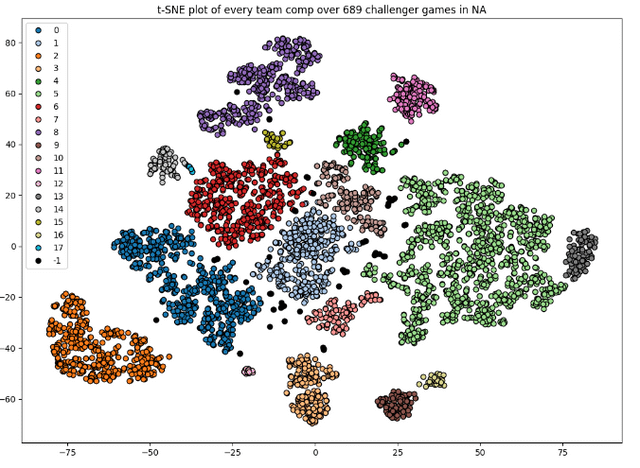

<a href = "https://wihi1131.github.io/Machine-Learning-Project/">Home</a>

  
  

    

      <b></b>
    

  

This project started with a simple goal - to determine if match-level data be utilized to predict who will triumph in a game of Teamfight Tactics. The pursuit of the answer to this query has led through a full arc of a modern data-science analysis. From acquiring data on thousands of matches from the highest-ranked competitive players through use of the Riot Games API, to cleaning and preprocessing, reduction and transformation of records, to fitting and evaluation of 19 different machine learning models, both unsupervised and supervised, a host of useful insights have been granted. Along the way, the tradeoffs between predictive power and human interpretability were showcased first-hand. The end result is a clear picture of what the numbers can (and cannot) say about how to achieve success in one of the world's most-played auto-battlers. 

The analysis completed via data exploration and unsupervised learning models such as K-means, hierarchical clustering, and DBSCAN provided an introductory expectations adjustment before the serious predictive models were even created. Principal component analysis revealed that reducing the data to only four dimensions retained up to 98% of the variance of a cleaned dataset of numerical attributes of players' matches, revealing a potentially powerful tool. However, the sheer amount of data extracted, amounting to over 1500 games, each with 8 separate players with a host of important board-state information, proved to be very difficult for unsupervised learning algorithms to classify independently. The most discernible split of the data was between players who placed in the top four out of eight contestants in a match, and those who did not, but the split provided by k-means was rough at best. Contrarily, association-rule mining techiques provided more actionable and interpretable information from the dataset. The traits of Bruiser, FormSwapper, and Cabal all proved to be intrinsically associated, among a few others, and the trait known as Ambassador reliably appeared together with Warband. This perhaps gave insight into why distance-based clustering was not very useful, because elite players likely know which strategies work well, and tend to choose them reliably. However, these rules learned from the dataset did not correlate with placement, highlighting the popularity of certain traits amongst challenger players without giving any specific strategic knowledge to high-level players looking to defeat other high-level opponents. 

  
  

    

      <b>This is an example of some successful clustering done on Challenger-level games from 3 years ago from a reddit user on r/Competitive TFT. Web tools such as metaTFT use similar methods of analysis. Link <a href = "https://www.reddit.com/r/CompetitiveTFT/comments/rnd2gr/low_dimensional_clustering_and_visualization_of/">here</a></b>
    

  

Reflecting upon the outcomes of the supervised learning models built, benchmarks were identified early. A Multinomial Naïve Bayes model achieved 62% accuracy on data containing nothing except for how many units a player ran in a particular match that corresponded to each particular trait (such as the ones mentioned above). This was somewhat impressive considering the baseline assumption of naïve bayes is one of conditional independence, which is clearly not the case with intertwined traits within a player's board. A logistic regression, freed from this independence assumption, heavily outperformed such a model, boasting an accuracy of 71%, reducing false positives and false negatives in its classification on a testing set. Using Support Vector Machines pushed performance even higher; a model using a polynomial kernel of degree two and a "C" parameter of one attained a 72.3% accuracy with 0.69 recall in classifying "podium" (top-four) finishers. This indicated how important pair-wise interactions were in terms of traits - any real TFT player can verify how well certain traits pair together with others. Decision trees offered more of a cautionary tale. Though they were easy to read and interpret which traits were most important, their performance was largely unreliable, especially in trying to predict specific placement of players from 1st to 8th place, unable to acheive any accuracy above 30%, except in the case of using it to again predict only top four placement or not. Turning to ensemble learning, a 300-tree random forest model yielded nearly 70% accuracy, showing the appeal of stability in ensemble methods at the cost of some interpretability. The largest takeaway from all this analysis was that prediction of placement within the top four participants in a match is certainly doable, and with only trait data of players. Incorporating even more information, such as item-level data, would surely improve these already decent classification models. 

Beyond the hard numbers produced by this in-depth analysis comes strategic insights for players. Though the data was collected from TFT Set 13 (which is no longer the current set), important trait information was extracted, and could be useful if Riot ever re-runs the set, as they have been known to do in the past. What was learned is as follows: boards that ran the trait Bloodhunter, which happened to be a trait with only a single unit (Warwick), and those that ran Bruiser along with FormSwapper and Cabal, seemed to dominate high-level play. Because traits proved to have as much predictive power on their own, without any other information, this can give insight to the game itself. This analysis indicates that high-level players should have a good sense of traits that their opponents are building as the game progresses, as this can tell them a lot of information without having to know any more specifics. This could mean that Challenger players don't necessarily have a massively better understanding of the game than lower-level players, but simply that they know what information in the game is the most important to pay attention to selectively. However, more analysis should be done on players' games in lower tiers of play to confirm this hypothesis. 

While the insights from this set may not be useful to current players for the time being, the methods used in this analysis could easily be applied to the current set, and similar insights could be extracted. It would be very straightforward to do so, and to find new information even though the newest set has completely different unit and trait information. While no single model built in this project reached professional-level esports predictive power, it at least demonstrated how data-driven tools can work. Platforms such as MetaTFT exist that provide real-time data-driven insights for players to take advantage of. It would not be a stretch to be able to translate some of the models used here to an application that offers its own strategic help and could be considered by players in the market for TFT guidance. Data science models cannot guarantee a first-place finish, but it clearly has a lot of power in being able to analyze games and identify what distinguishes the greatest victories from the lowest defeats. 

<a href = "https://wihi1131.github.io/Machine-Learning-Project/">Home</a>
