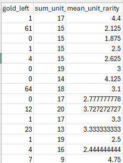
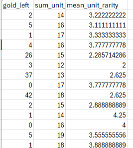
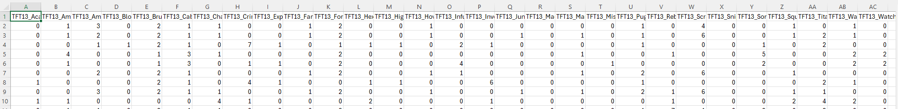
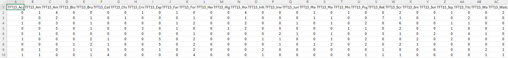
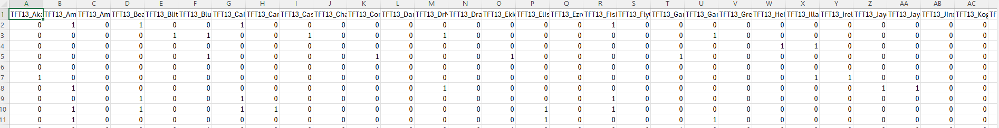
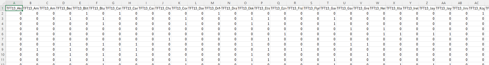

<a href = "https://wihi1131.github.io/Machine-Learning-Project/">Home</a>

# Decision Trees

## Overview

This algorithm is named for its shape, and appears like an inverted "tree" with branches "growing" from a single point, which we call a root. Each splitting point in the tree is called a node. At the root node, a question is asked about the data. For example, we might have a question about classification in regards to a dataset, such as: "does a data point classified as a '1' have more or less of a certain feature than a specified attribute?", or: "does a data point classified as a '0' contain a certain feature, or does it not?". An initial question like this is asked first at the root node, and depending on the value of any data point, we will follow down one "branch" of the tree if the answer is yes, and a different branch if the answer is no (trees may have more than two branches leading from any node, but for simplification, simply imagine two branches from any single node in the tree). After answering this question, further nodes down the tree specify which data point we have and where it will fall based on answers to more and more specific questions. Finally, at the bottom of the tree, we reach a "leaf" node - there are no more nodes to follow when we reach a leaf, and the leaf we reach tells us how we may classify our data point in question. 

The decision tree is trained on data for which we already have classification labels - the model examines each point of training data and discovers what value thresholds of certain features determine whether a data will be classified into one category or another. The algorithm scans a series of candidate thresholds for each feature in the dataset, looking for what will best separate classes. It examines a series of candidates for where to split groups of data into two (at each level of the tree), and computes an impurity score, using either the metric of Gini or Entropy. A Gini impurity score measures how likely a randomly chosen element will be misclassified within a set (in this case, out of all data that will be split by a node), while an Entropy score is a more precise measure of randomness within a set, and tells us how much information is required to determine a class for a data point. The goal in using either of these two metrics is to measure information gain, which is the amount the "impurity" of a node will decrease after splitting. The goal is to maximize the information gain by ensuring that the amount of disorder lost by each split is maximized, and that each subsequent node is more and more "pure". Gini is a good metric to use if we care more about the speed of the algorithm, while Entropy is a more precise metric but takes longer to calculate. The tree is trained when it has identified all splits and nodes, and the depth of the tree has been found such that each leaf node (and each split along the way) is as pure as possible. 

After training, the model is given new data and bins it according to the features it has and how they correspond to the splitting decisions the tree has already found. This step is done extremely quickly, since no further calculations need to be done, and each new data point can simply flow down the tree until it is binned by a leaf and classified (note that it is also possible to use decision trees to find continuous values). 

## Data Prep and Code

### CODE FOR ALL PROCESSES EXPLAINED BELOW CAN BE FOUND HERE: <a href = "https://github.com/WiHi1131/Machine-Learning-Project/blob/main/code/DT.ipynb">DT CODE</a>

To create data suitable for training and testing of three different Decision Tree models, data was prepared from three different datasets. The first dataset contained data on gold remaining for a player in a match at the time of elimination. The second dataset contained information on which traits were fielded and with how many units per trait for a player in a match, and the third dataset contained information on specific units fielded by a player in a match at the time of elimination. 

These three datasets were combined, cleaned, transformed, and then separated into training and testing sets suitable for each tree. The dataset designed to be used for the first decision tree model was obtained by combining information from the original 1st and 3rd datasets mentioned above. This dataset contains information on gold remaining, the sum of the tiers of all units fielded by a player, and the mean rarity of units fielded by that player (all at time of elimination). This data was divided into training and testing sets in an 80%/20% split, as seen by the images and links below: 

  
  

    

      <b>Training Data. Full Dataset can be found here: <a href = "https://github.com/WiHi1131/Machine-Learning-Project/blob/main/data/DT_1_training_data.csv">Training Dataset</a></b>
    

  

  
  

    

      <b>Testing Data. Full Dataset can be found here: <a href = "https://github.com/WiHi1131/Machine-Learning-Project/blob/main/data/DT_1_testing_data.csv">Testing Dataset</a></b>
    

  

The dataset to be used for the second DT model is identical to the data used to train our Naive Bayes model (explained <a href = "https://wihi1131.github.io/Machine-Learning-Project/NB">here</a>), and contains data on which traits were fielded by a player in a match at the time of elimination, as well as the number of units corresponding to each trait. Note that this dataset contains information on whether or not a player "podiumed" or not (placed within the top 4 players), instead of exact placement data. This data was also divided with an 80%/20% split for training and testing, respectively. Images of snippets of training and testing datasets, as well as links to full datasets, are below: 

  
  

    

      <b>Training Data. Full Dataset can be found here: <a href = "https://github.com/WiHi1131/Machine-Learning-Project/blob/main/data/DT_2_training_data.csv">Training Dataset</a></b>
    

  

  
  

    

      <b>Testing Data. Full Dataset can be found here: <a href = "https://github.com/WiHi1131/Machine-Learning-Project/blob/main/data/DT_2_testing_data.csv">Testing Dataset</a></b>
    

  

The final dataset, used for our final DT model, contains binary information on whether or not a particular unit was fielded by a player at the time of their elimination. Again, this data was divided into training and testing sets with an 80%/20% split. Image snippets of training and testing data, as well as links to full datasets, are below: 

  
  

    

      <b>Training Data. Full Dataset can be found here: <a href = "https://github.com/WiHi1131/Machine-Learning-Project/blob/main/data/DT_3_training_data.csv">Training Dataset</a></b>
    

  

  
  

    

      <b>Testing Data. Full Dataset can be found here: <a href = "https://github.com/WiHi1131/Machine-Learning-Project/blob/main/data/DT_3_testing_data.csv">Testing Dataset</a></b>
    

  

## Results and Conclusions

Below is a visualization of our first decision tree: 

<a href = "https://wihi1131.github.io/Machine-Learning-Project/">Home</a>
