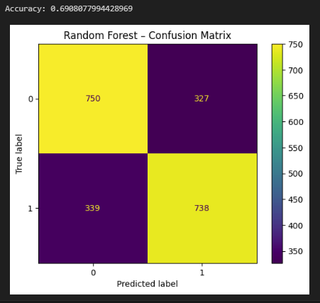
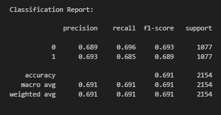

<a href = "https://wihi1131.github.io/Machine-Learning-Project/">Home</a>

# Ensembles

## Overview

Ensemble learning is a technique that trains more basic, "base" models and conglomerates what they learn individually into one model. Each model that is used within the ensemble contributes to the ensemble as a whole, so any singular model usually cannot outweight what the others find. Ensembles can use many weak models to create a strong one, or use models that are already useful on their own to improve their accuracy [1]. 

A major benefit to ensembles is their overcoming a typical issue with singular models: the bias-variance trade-off. Even if a model fits training data very well, it may overfit and not be able to generalize well. Ensembles fix this problem by combining predictions of many types of models into one, which can remove overfitting while maintaining accuracy [1]. Some examples of ensemble methods from the sklearn library are: random forests, XGBoost, AdaBoost, Bagging, Stacking, Voting and SVM and Decision Tree combinations, among others [2]. 

Ensemble methods are particularly useful with limited datasets or for those with major class imbalances. They are a subject of ongoing research, and new methods such as mitigating bias and post-processing of other models are key application areas [1]. 

## Data Prep and Code

### CODE FOR ALL PROCESSES EXPLAINED BELOW CAN BE FOUND HERE: <a href = "https://github.com/WiHi1131/Machine-Learning-Project/blob/main/code/Ensembles.ipynb">ENSEMBLES CODE</a>

Once again, cleaned trait counts data was used for this analysis, as a classification task in order to predict whether whether players placed in the top four participants of a given match or not. 

Training and testing datasets were prepared with an 80/20 split, as with all other models. Below are snippets of the training and testing datasets and links to the data used: 

  
  

    

      <b>Training Data. Full Dataset can be found here: <a href = "https://github.com/WiHi1131/Machine-Learning-Project/blob/main/data/ensemble_training_data.csv">Training Dataset</a></b>
    

  

  
  

    

      <b>Testing Data. Full Dataset can be found here: <a href = "https://github.com/WiHi1131/Machine-Learning-Project/blob/main/data/ensemble_testing_data.csv">Testing Dataset</a></b>
    

  

A ***Random Forest Classifier*** was then decided as the ensemble method to try on this dataset, fitting considerably since a decision tree was already fit to the dataset, providing an avenue for direct comparison (more info <a href = "https://wihi1131.github.io/Machine-Learning-Project/DT">here</a>). 

## Results and Discussion

The below images show the accuracy, confusion matrix, and classification report of the RandomForest on the dataset: 

  
  

    

      <b>Accuracy Score and Confusion Matrix of our Random Forest Classifier</b>
    

  

  
  

    

      <b>Classification Report of our Random Forest Classifier</b>
    

  

The accuracy score tells us that, out of 2154 board compositions in the testing set, this random forest model bins each composition in the correct bucket - either finishing in the top four or not, about 7 times out of 10. The model still misclassifies around 3 in 10 boards, so it should definitely be taken with a grain of salt, but is still useful. The precision score for each class tell us how correct the model is for each class specifically. These are roughly equal for both classes (0.689 vs 0.693), but the model is correct slightly more times when it predicts that a player will finish in the top four than when it predicts that a player will not. 

A single decision tree on this same dataset was performed (more info <a href = "https://wihi1131.github.io/Machine-Learning-Project/DT">here</a>), and the accuracy was found to be around 67%, so this random forest classifier has improved our accuracy slightly. The random forest code used fits 300 trees to the data instead of just one. This may seem like overkill for only a two percentage point increase in accuracy, but this still means that around one extra composition in 50 is correctly classified versus using the single decision tree model. The exchange made for this extra accuracy is that our results are less interpretable. With the decision tree, we could directly follow a visual tree to find out which traits were more important for determining placement, but it is much harder to read a random forest classifier in the same way, since it is the average performance over hundreds of trees. One plus-side of the random forest ensemble is that it is less sensitive. This can be seen by changing the n_estimators parameter in the model's code - increasing n_estimators even to 1000 (which means 1000 trees are built), barely impacts the accuracy score, increasing it by 0.003. This is a good showcasing of how ensemble methods can not only help accuracy but also improve stability when it comes to using machine learning models. 

## Sources

- [1] IBM. “Ensemble Learning.” Ibm.com, 18 Mar. 2024, www.ibm.com/think/topics/ensemble-learning.

- [2] scikit-learn. “1.11. Ensemble Methods — Scikit-Learn 0.22.1 Documentation.” Scikit-Learn.org, 2012, scikit-learn.org/stable/modules/ensemble.html.

<a href = "https://wihi1131.github.io/Machine-Learning-Project/">Home</a>