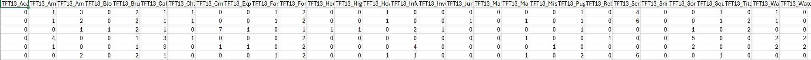
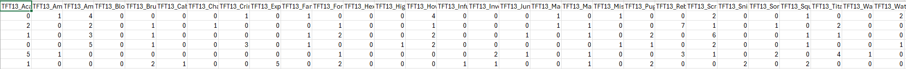

<a href = "https://wihi1131.github.io/Machine-Learning-Project/">Home</a>

# Ensembles

## Overview

Ensemble learning is a technique that trains more basic, "base" models and conglomerates what they learn individually into one model. Each model that is used within the ensemble contributes to the ensemble as a whole, so any singular model usually cannot outweight what the others find. Ensembles can use many weak models to create a strong one, or use models that are already useful on their own to improve their accuracy [1]. 

A major benefit to ensembles is their overcoming a typical issue with singular models: the bias-variance trade-off. Even if a model fits training data very well, it may overfit and not be able to generalize well. Ensembles fix this problem by combining predictions of many types of models into one, which can remove overfitting while maintaining accuracy [1]. Some examples of ensemble methods from the sklearn library are: random forests, XGBoost, AdaBoost, Bagging, Stacking, Voting and SVM and Decision Tree combinations, among others [2]. 

Ensemble methods are particularly useful with limited datasets or for those with major class imbalances. They are a subject of ongoing research, and new methods such as mitigating bias and post-processing of other models are key application areas [1]. 

## Data Prep and Code

### CODE FOR ALL PROCESSES EXPLAINED BELOW CAN BE FOUND HERE: <a href = "https://github.com/WiHi1131/Machine-Learning-Project/blob/main/code/Ensembles.ipynb">ENSEMBLES CODE</a>

Once again, cleaned trait counts data was used for this analysis, as a classification task in order to predict whether whether players placed in the top four participants of a given match or not. 

Training and testing datasets were prepared with an 80/20 split, as with all other models. Below are snippets of the training and testing datasets and links to the data used: 

  
  

    

      <b>Training Data. Full Dataset can be found here: <a href = "https://github.com/WiHi1131/Machine-Learning-Project/blob/main/data/_training_data.csv">Training Dataset</a></b>
    

  

  
  

    

      <b>Testing Data. Full Dataset can be found here: <a href = "https://github.com/WiHi1131/Machine-Learning-Project/blob/main/data/ensemble_testing_data.csv">Testing Dataset</a></b>
    

  

A ***Random Forest Classifier*** was then decided as the ensemble method to try on this dataset, fitting considerably since a decision tree was already fit to the dataset, providing an avenue for direct comparison. 

## Results and Discussion

## Sources

- [1] IBM. “Ensemble Learning.” Ibm.com, 18 Mar. 2024, www.ibm.com/think/topics/ensemble-learning.

- [2] scikit-learn. “1.11. Ensemble Methods — Scikit-Learn 0.22.1 Documentation.” Scikit-Learn.org, 2012, scikit-learn.org/stable/modules/ensemble.html.

<a href = "https://wihi1131.github.io/Machine-Learning-Project/">Home</a>