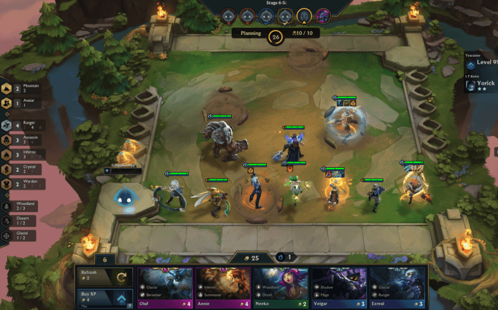

# Introduction 

Teamfight Tactics (or TFT for short) is a game owned by the world-renowned game developer Riot Games. In October of 2024, the game had 33 million players, making it one of the most popular games in the world [1]. The game is a flagship for the genre of 'auto-battlers', which is a "strategy game where you recruit armies that battle automatically" [2]. Eight human opponents play in the same game, and fight until there is only one left standing. The game is heavily dependent on acquiring controlling resources, namely gold, the in-game currency used to purchase champions or heroes that are placed on a board vaguely reminiscent of a chess board, that then battle other players' champions in a series of 1-v-1 rounds. Whichever player has the strongest team emerges triumphant, with the losing player losing health, or their resource that keeps them alive in the game. Any player that is eliminated to 0 health loses the game. 

Though the game is difficult for new players to learn, and even more difficult to master, like with any game the players have one desire: to come out on top. One key way that players with data science skills might be able to concoct an advantage is through analyzing data procured from Riot Games' Developer API. This API contains extensive data on TFT players and matches, including extremely detailed information on specific champions bought, gold spent, final placement, and much more. Though predicting player placement in a TFT game is a difficult task, and gathering enough of the extensive match data is no easy task, machine learning models, used smartly, may be able to aid in prediction of the outcomes of TFT games. This project will be an exploration in that endeavor. 

  
  

    

      <b>This is an example of a TFT Board. Notice the units placed on the board, and a menu on the bottom part of the screen showing new units for purchase</b>
    

  

# Questions This Project Will Attempt to Answer
1. Can remaining gold a player has at the time of their elimination be a useful feature in predicting final placement in a TFT game?
2. Which traits within a player's team contribute most to predicting final placement?
3. Which units within a player's team contribute most to predicting final placement?
4. Which items used by players contribute most to predicting final placement?
5. Is TFT Set 4.5 more predictable by machine learning models or is TFT Set 13 more predictable?
6. Is there a better metric than placement, such as the time eliminated in seconds, than can be predicted?
7. Is there a correlation between tier of particular units and player placement?
8. Is there a way to identify strategy (early game vs mid-game vs late-game) from the data available?
9. If strategy can be identified, is strategy choice useful in prediction of player placement?
10. What is unique to challenger player's games that may not be found in lower elo games? 

# References 
- [1] 1v9. (2024, October 19). TFT Player count and statistics 2024. https://1v9.gg/blog/tft-player-count

- [2] Cox, M. (2019, August 1). Spawn Point: What on earth is an auto battler? Rock Paper Shotgun. https://www.rockpapershotgun.com/what-is-an-auto-battler
