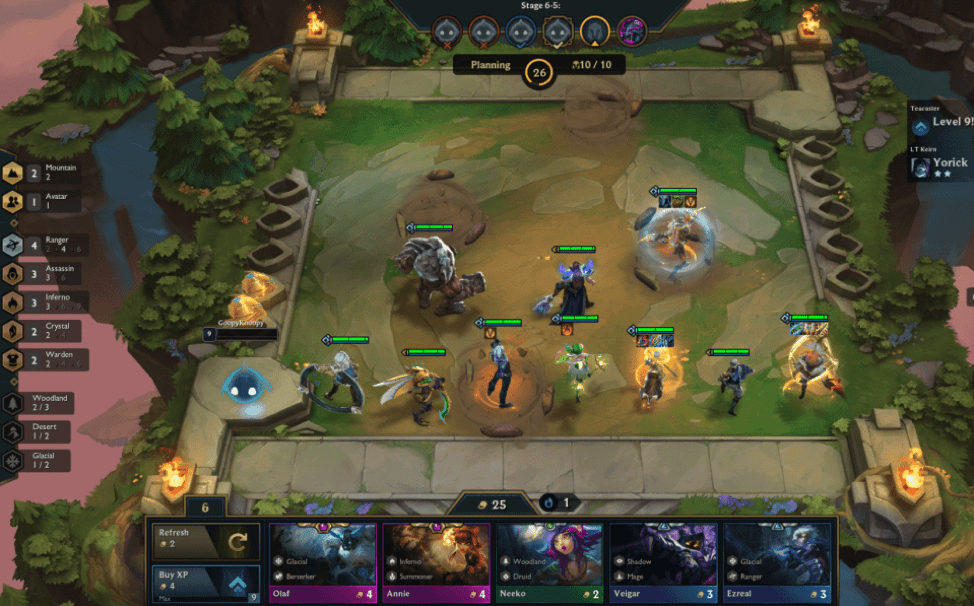
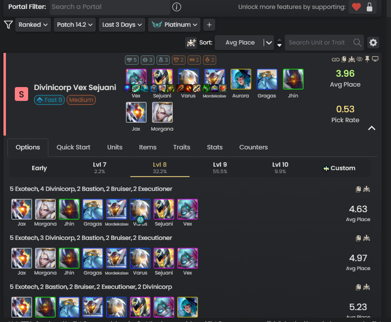

<a href = "https://wihi1131.github.io/Machine-Learning-Project/">Home</a>

# Introduction 

Teamfight Tactics (or TFT for short) is a game owned by the world-renowned game developer Riot Games. In October of 2024, the game had 33 million players, making it one of the most popular games in the world [1]. The game is a flagship for the genre of 'auto-battlers', which is a "strategy game where you recruit armies that battle automatically" [2]. Eight human opponents play in the same game, and fight until there is only one left standing. The game is heavily dependent on acquiring controlling resources, namely gold, the in-game currency used to purchase champions or heroes that are placed on a board vaguely reminiscent of a chess board, that then battle other players' champions in a series of 1-v-1 rounds. Whichever player has the strongest team emerges triumphant, with the losing player losing health, or their resource that keeps them alive in the game. Any player that is eliminated to 0 health loses the game. 

  
  

    

      <b>This is an example of a TFT Board. Notice the units placed on the board, and a menu on the bottom part of the screen showing new units for purchase</b>
    

  

Though the game is difficult for new players to learn, and even more difficult to master, like with any game the players have one desire: to come out on top. One key way that players with data science skills might be able to concoct an advantage is through analyzing data procured from Riot Games' Developer API. This API contains extensive data on TFT players and matches, including extremely detailed information on specific champions bought, gold spent, final placement, and much more. Though predicting player placement in a TFT game is a difficult task, and gathering enough of the extensive match data is no easy task, machine learning models, used smartly, may be able to aid in prediction of the outcomes of TFT games. This project will be an exploration in that endeavor. 

Although collecting and analyzing data is critical, understanding and gaining insights from data and being able to utilize these findings to make strategic decisions is paramount. Online "tier lists" created by Teamfight Tactics influencers or professional players give many players somewhere to place their strategic footing, but these lists can quickly fall out of relevance if the meta changes. Proper deployment of a sufficiently large database of match histories may be able to identify emerging tactics or synergies before others catch on. Rigorous exploration of data such as champion traits, item usage, or other metrics can give all players an edge regardless of experience level. Ultimately, the powerful combination of game-sense and data-driven insights can be a game changer for any player, and the conclusions generated from this project will aim to provide such an advantage. 

Besides providing a competitive edge, analysis of TFT data could help improve and enrich player experience. Finding team compositions that feel satisfying to players, regardless of whether or not they grant an advantage, could be a boon to the TFT community. Likewise, investigation could be done to discover if certain compositions fielded by opponents cause players to surrender the game at an early point, which could identify particularly frustrating or "unfair" strategies. Insights like these can help both players and game designers. Players of games in different genres have been known to utilize analytics platforms that give users a "saltiness" score for certain deckbuilding strategies, which indicate how much opponents may feel as if the cards or strategies they use are unfair or will cause undue resentment. This is especially useful for games played amongst friends that players game with regularly. The implications of data analysis of this kind can have impacts that reach beyond mere strategy and help contribute to design decisions that affect overall game enjoyment for all players, not just competitive ones. 

Each page of this site dives into systematic, data-driven exploration of Teamfight Tactics and the science of prediction of player placement. Using thousands of matches pulled from the Riot API, clean data was extracted showcasing the resources used and team compositions utilized by players at the highest competitive level. While insight into strategic decisions are difficult to discern from this raw data, the information gained from this website was used to train various machine learning models to discover if the placement of players in a particular match could be determined, and how well if so. Both unsupervised and supervised learning models were applied to this data. Not just accuracy, but interpretability of these models was taken into account. This was all done as a way to explore how helpful applications, such as MetaTFT, extract and use data to give players real-time recommendations for their strategic benefit. An image of what these applications look like is given below. Though this project only explores the background data science done in service to help players (and potentially game designers), in theory interactive an interactive application or dashboard like the one below could easily be created with the data science from this project working in the background to power the revelations it could give to players. This highlights that the methodologies used in this project could, in theory, be used on any future sets, not just the one the data was extracted from. This is critical for any application, as the game constantly changes every few months. It is the ultimate goal that the findings and models of this project can be understood by those who have never played the game, and that the data-driven insights are useful as a way to not only understand what makes TFT players successful, but how data science and machine learning techniques work in general. 

  
  

    

      <b>This is a picture of the information that can be gained from a TFT application designed to be used by players to help them make real-time strategic decisions as they play a match. This particular application is called MetaTFT. This image may be confusing to someone who has never played the game, but particularly note statistical information such as the average place and pick rate of this "composition". The data-driven insights from this project could, in theory, be used to power a similar application. </b>
    

  

# Questions This Project Will Attempt to Answer
1. Can remaining gold a player has at the time of their elimination be a useful feature in predicting final placement in a TFT game?
2. Which traits within a player's team contribute most to predicting final placement?
3. Which units within a player's team contribute most to predicting final placement?
4. Which items used by players contribute most to predicting final placement?
5. Is TFT Set 4.5 more predictable by machine learning models or is TFT Set 13 more predictable?
6. Is there a better metric than placement, such as the time eliminated in seconds, than can be predicted?
7. Is there a correlation between tier of particular units and player placement?
8. Is there a way to identify strategy (early game vs mid-game vs late-game) from the data available?
9. If strategy can be identified, is strategy choice useful in prediction of player placement?
10. What is unique to challenger player's games that may not be found in lower elo games? 

# References 
- [1] 1v9. (2024, October 19). TFT Player count and statistics 2024. https://1v9.gg/blog/tft-player-count

- [2] Cox, M. (2019, August 1). Spawn Point: What on earth is an auto battler? Rock Paper Shotgun. https://www.rockpapershotgun.com/what-is-an-auto-battler

<a href = "https://wihi1131.github.io/Machine-Learning-Project/">Home</a>
