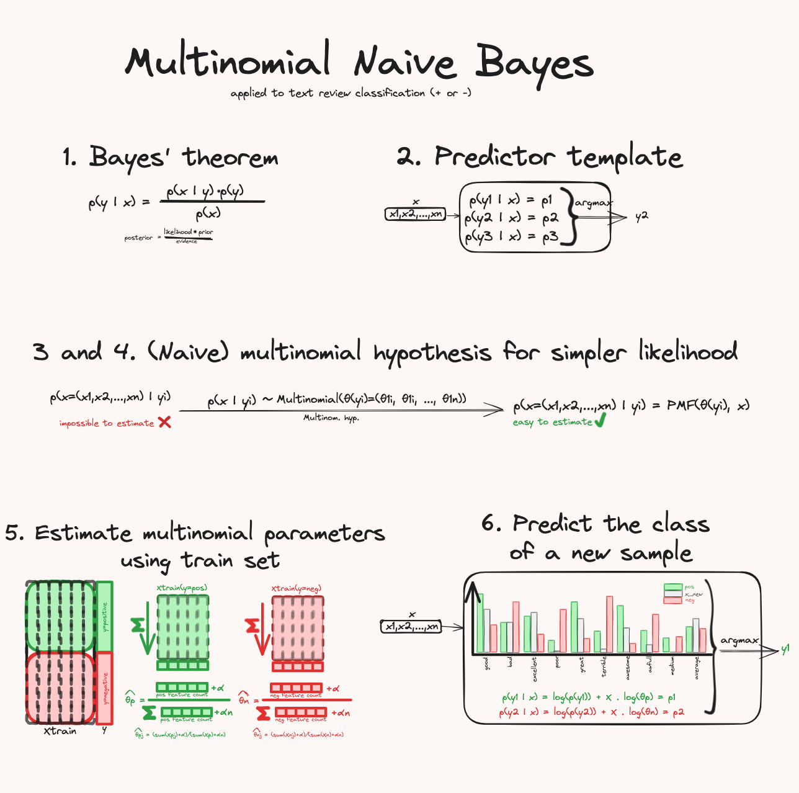
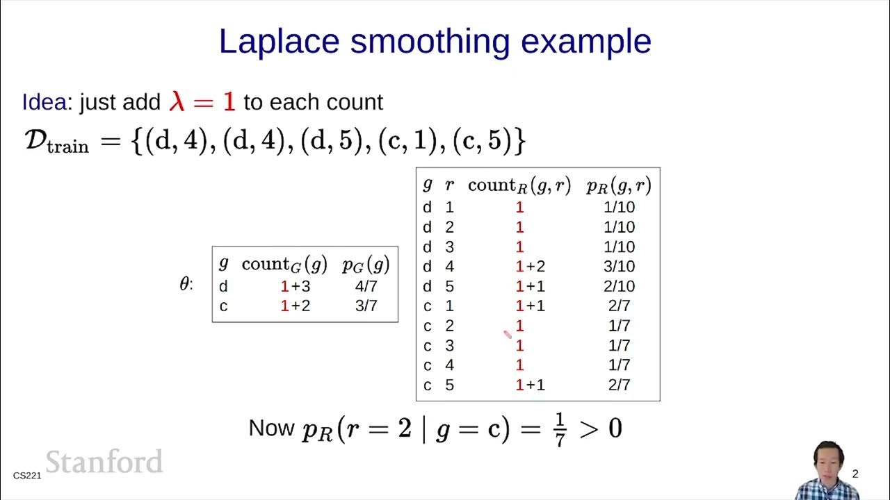
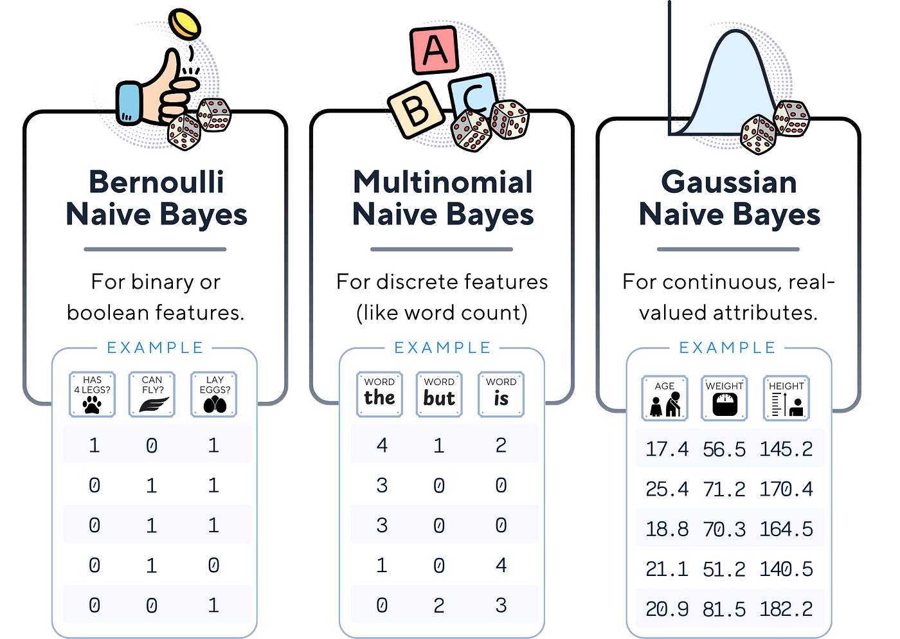
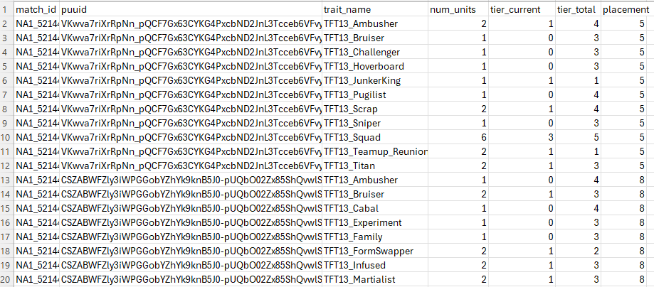
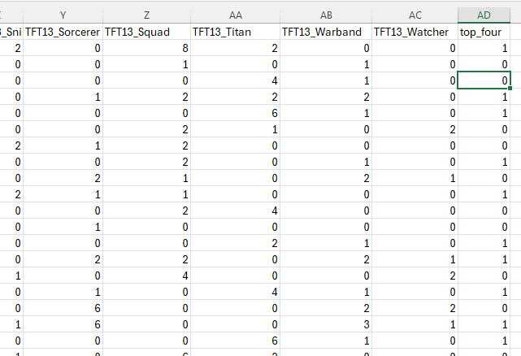
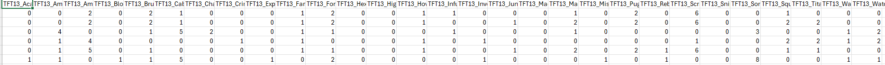
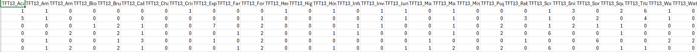
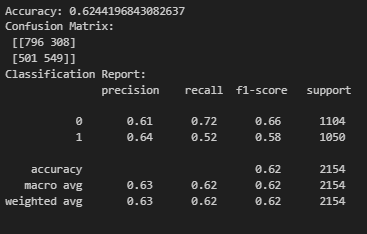

<a href = "https://wihi1131.github.io/Machine-Learning-Project/">Home</a>

# Naïve Bayes' 

## Overview

Naïve Bayesian algorithms are a method of supervised learning. These algorithms are based on Bayes' Theorem, which deals with probabilities of events occurring based on prior knowledge of causes of those events also occurring. We say that these algorithms are "naïve" because we assume conditional independence of features, which may not actually be the case. Even with this simplifying assumption, these algorithms have still been shown to work very well in real-world applications such as spam filtering [1]. 

We use different types of Naïve Bayesian (NB) algorithms depending on the distribution of data we are dealing with, as explained below: 

- **Multinomial NB** is catered for use with discrete data, such as with trying to classify text documents with word counts [1]. 
- Bernoulli NB is designed to be used with binary or boolean data; multiple features can be used but each is "assumed to be a binary-valued (Bernoulli, boolean) variable" [1].
- Other types depending on distribution of data, such as Gaussian NB and Categorical NB, as necessary.

### Multinomial Naïve Bayes

Multinomial Naïve Bayes is designed to be used with features containing counts, such as the text document example above. Bayes' Theorem works within this algorithm to update class probabilities (such as if a text document is spam or not spam) as it sees increasing evidence within the word counts. To elaborate, the Multinomial NB algorithm calculates conditional probabilities of each feature (words in our example) when given the class label to begin. Under the assumption that all features are conditionally independent, the algorithm calculates the probability of seeing all features (word counts) by multiplying them together, and then can predict the class of an unseen data point by finding which class has a higher probability of containing all known feature probabilities in the new data point. 

The below image was taken from medium.com[2] and gives a simplified overview: 

  
  

    

      <b>This image gives a high-level explanation for how Multinomial NB works</b>
    

  

### Smoothing

A key piece of Naïve Bayes is additive smoothing, otherwise known as Laplace smoothing or Lidstone smoothing. In our example of a text document with word counts, imagine that one word never appears in the training data for a class (for example, imagine the word "offer" never appears in training documents that are labeled as "not spam"). The algorithm then thinks that the probability estimate for a document containing the word "offer" is 0% that it would be labeled as "not spam", and would always label it as spam when applied to unseen data, which may not be the case. Smoothing fixes this issue by adding a small constant to all word counts. This means that no probability will ever be exactly zero, so the aforementioned problem is avoided. This constant, which we call $\alpha$, can be adjusted depending on how much smoothing the user want to apply. 

The below image, taken from a youtube video thumbnail from Stanford Online [3], nicely illustrates how smoothing fixes probabilities of counts so that they will never be 0, even if a particular count is 0: 

  
  

    

      <b>This illustrates how smoothing affects probabilities and counts</b>
    

  

### Bernoulli Naïve Bayes

In contrast to Multinomial NB, which deals with integer counts, Bernoulli NB deals with binary or boolean data, where there are only two options for values of features (0 or 1, true or false, etc). Bernoulli NB only verifies whether a feature is present or not by checking whether a value of a feature is 1 or 0. 

The image below from Medium.com[4] compares and contrasts the types of data used for Bernoulli NB vs Multinomial NB (and also includes an image of Gaussian NB, not covered on this page): 

  
  

    

      <b>This shows the types of data used for different types of NB algorithms</b>
    

  

## Data Prep and Code 

### CODE FOR ALL PROCESSES EXPLAINED BELOW CAN BE FOUND HERE: <a href = "https://github.com/WiHi1131/Machine-Learning-Project/blob/main/code/NB.ipynb">NB CODE</a>

### Multinomial NB

The multinomial NB algorithm would be ideally suited to discover whether the 'counts' of units in certain traits can be used to predict whether a player finished in the top four players in a game or not. To find this, we first need to clean our data so it is suited for the algorithm. 

The below image is a snippet of data we have already prepared, showing trait information, including the number of units (num_units) for each trait fielded by a player in a particular game, along with their placement, which is exactly what we are interested in. 

  
  

    

      <b>Note the trait_name and num_units columns, along with the placement column</b>
    

  

To transform this into a format more suitable for Multinomial NB, we need to make each row correspond to a single player in a single match, have every column be a trait, and transform the placement column into containing a '1' if the player finished in the top four, and a '0' if they did not. After performing this in Python (Code linked above), our cleaned data looks like this: 

  
  

    

      <b>Note that many columns were not included in the image above. We can see counts of number of units for each trait and whether or not the player placed in the top four, marked with a '1' or a '0', respectively</b>
    

  

  
  

    

      <b>Training Data. Full Dataset can be found here: <a href = "https://github.com/WiHi1131/Machine-Learning-Project/blob/main/data/multinb_training_data.csv">Training Dataset</a></b>
    

  

  
  

    

      <b>Testing Data. Full Dataset can be found here: <a href = "https://github.com/WiHi1131/Machine-Learning-Project/blob/main/data/multinb_testing_data.csv">Testing Dataset</a></b>
    

  

The model was trained and tested on the datasets from the snippet above within the coding notebook linked above. Results are discussed below. 

## Results and Conclusions

The below image shows the accuracy and confusion matrix from running multinomial NB on our trait data: 

  
  

    

      <b>Note the accuracy score of approximately 62%, and recall scores of 0.72 for class 0 and 0.52 for class 1.</b>
    

  

The confusion matrix and scores above give us an accuracy score of approximately 62%. This indicates that trait-counts do give a somewhat predictive outlook on whether a player will place in the top 4, but only at a moderate level - predictions made by multinomial NB should not be trusted outright. The model has a recall score on class 0 of 0.72, which means that the model is better at identifying team compositions that will not place in the top 4 - we can trust the model more if it is telling us that a player's board will not place in the top 4 (also known as "podiuming"), although this still should be taken with a grain of salt, since the model is only accurate at doing this 72% of the time. Note also that the model has a low recall score of 0.52 for class 1. This means that a little less than half the time, the model will not accurately identify whether a player's board will podium. The confusion matrix shows lots of false negatives (501 of them), and is fairly poor at identifying winning boards. This shows that there are many more important factors to consider besides trait counts that influence placement - a more complex model trained on more information, such as items built or interest gained, would likely do better. 

## Sources

- [1] 1.9. Naive Bayes. (n.d.). Scikit-learn. https://scikit-learn.org/stable/modules/naive_bayes.html

- [2] Mocquin, Y. (2024, November 30). Multinomial Naive Bayes Classifier - TDS Archive - Medium. Medium. https://medium.com/data-science/multinomial-naive-bayes-classifier-c861311caff9

- [3] Stanford Online. (2022, May 31). Bayesian Networks 8 - Smoothing | Stanford CS221: AI (Autumn 2021) [Video]. YouTube. https://www.youtube.com/watch?v=M7rWvN_0xbw

- [4] Baladram, S. (2024, November 30). Bernoulli Naive Bayes | TDS Archive. Medium. https://medium.com/data-science/bernoulli-naive-bayes-explained-a-visual-guide-with-code-examples-for-beginners-aec39771ddd6

<a href = "https://wihi1131.github.io/Machine-Learning-Project/">Home</a>
