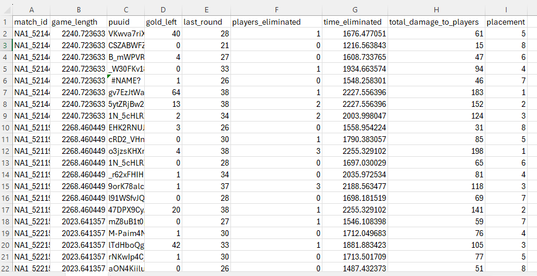
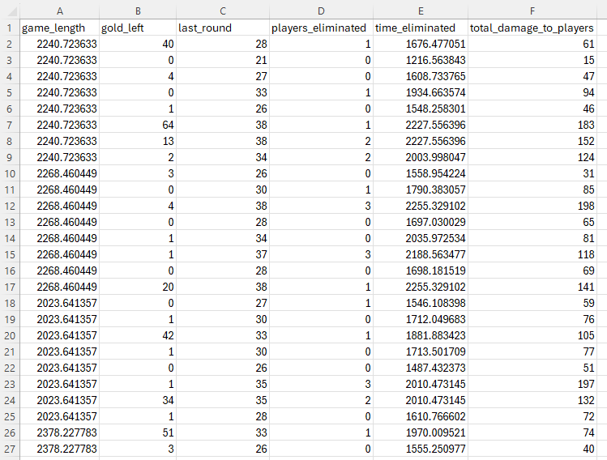
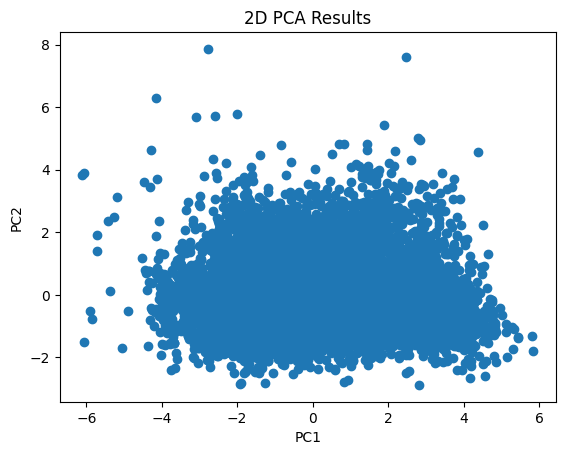
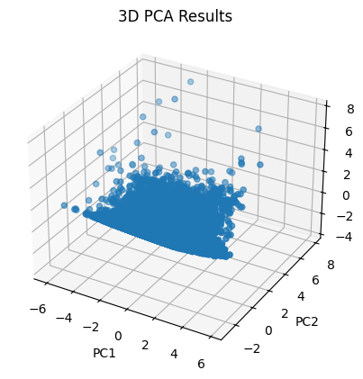
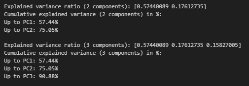
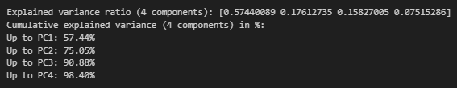

<a href = "https://wihi1131.github.io/Machine-Learning-Project/">Home</a>

# PCA

Principal Component Analysis, or PCA, is a means by which to reduce the complexity of a dataset. Using sophisticated linear algebra and coding techniques, we can use PCA to eliminate unnecessary parts of our data that do not give us a lot of information. By using PCA as a statistical "editing" technique, we can learn which parts, or "dimensions" of our dataset summarize that dataset the best. Reduced datasets can often be easier to use to train machine learning models. 

# Data

## Before Cleaning

  
  

    

      <b>This is the data that PCA will be performed on, before cleaning. Note that the "label" in this case would be placement. Note also the many quantitative features. Time measurements (game length and time eliminated) are in seconds. Link to data: <a href = "https://github.com/WiHi1131/Machine-Learning-Project/blob/main/data/PRE_PCA.csv">Pre-PCA Data</a></b>
    

  

## After Cleaning

  
  

    

      <b>This is the data that PCA will be performed on, after cleaning. Note that the "placement" column has been removed, and both non-quantitative columns have also been removed. Link to data: <a href = "https://github.com/WiHi1131/Machine-Learning-Project/blob/main/data/PCA.csv">Cleaned PCA Data</a></b>
    

  

# Visualizations of the Data

  
  

    

      <b>This is a scatterplot of the two principal components when PCA is performed on the data and the dimensions of the data are reduced to two. Note that data was scaled before PCA was performed.</b>
    

  

  
  

    

      <b>This is a 3D plot of the three principal components remaining when PCA is performed on the data and dimensions are reduced to three.</b>
    

  

# Information Remaining

When performing PCA in Python, we can output how much of the explained variance ratio is caputured by our principal components. This tells us how much of the total variance in the dataset is explained by each principal component. In other words, we can see how much information is retained when we reduce our dimensions. The image below shows how much of our information is kept by the principal components we have found for both two and three dimensions. 

  
  

    

      <b>This is a screenshot of Python output showing how much of our explained variance ratio is explained by each Principal Component. We can see that the first principal component contains about 57.44% of the information we originally had in our full dataset. When we add the second principal component, cumulatively our dataset contains 75.05% of the information that it originally had. When we add a third principal component, our reduced dataset contains 90.88% of the information it had before conducting PCA. </b>
    

  

Overall, 75.05% of the information remains in the 2D dataset, and 90.88% of the information remains in the 3D dataset. 

If we want to increase our dimensions until we retain at least 95% of the original information, we would only need to add one additional principal component. The image below gives our cumulative explained variance ratio when we use PCA to get four principal components: 

  
  

    

      <b>This is the output when we conduct PCA with 4 principal components. We can see that adding a fourth principal component means that 98.40% of the information from the original dataset is retained, which eclipses the goal of retaining at least 95% of the original dataset. </b>
    

  

<a href = "https://wihi1131.github.io/Machine-Learning-Project/">Home</a>
