<a href = "https://wihi1131.github.io/Machine-Learning-Project/">Home</a>

# Support Vector Machines

## Overview

Support Vector Machines (SVMs for short) are a type of supervised algorithm that can be used for either classification or regression. They function through the use of a hyperplane, learned from analyzing input data. The goal of an SVM is to optimize this hyperplane such that it separtes different classes of data, and to maximize a space known as a margin in-between the classes. We call the nearest data points to the hyperplane support vectors, and both are used when defining what is known as a decision boundary. New data points are binned into one side or the other of this decision boundary based on their features by the algorithm. 

### Support Vector Machines are Linear Separators

The decision function for the hyperplane is given by: 

f(x)=sign(w^⊤x+b) [1]

Where w is the weight vector, x is an input vector of data points, and b is the bias, or error term. This is clearly a linear equation (reminiscent of y = mx + b). The image below illustrates a hyperplane separating two classes of data: 

  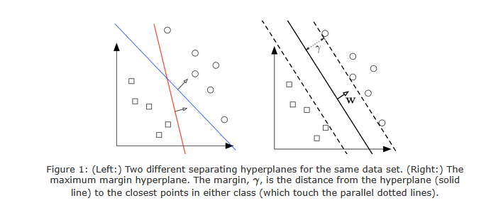
  

    

      <b>This is an example of a the margin hyperplane for an SVM model [1]. </b>
    

  

Even if the data isn't linearly separable, SVMs transform the data into a space where a flat, straight hyperplane will work to separate the data linearly. This is done using the kernel trick, described below. 

### The Kernel Trick and the Importance of the Dot Product

A kernel is a function that is used to arrange and transform data and aids the SVM algorithm in its function to bin data. They project the original data onto a space with more dimensions, such that a hyperplane can separate them where it wouldn't have been able to before [2]. 

A kernel function is defined as: 

k(x, z) = Φ(x) · Φ(z) [3]

where Φ is an embedding, or a kind of representation learned from the data, and x and z are two input data points. This is what allows the transformation of the lower-dimensional data into a higher dimensional feature space. Note that the above equation is defined as a dot product of two vectors. This works as intended because the kernel transformation is done using inner products of training vectors, and not using the vectors themselves. In other words, the dot product of x and z is done first, and then the kernel function is applied to said dot product. This means we never have to compute Φ(x) or Φ(z) directly, which is important because the embedding Φ can lie in extremely high dimensions. When we apply the kernel function to an inner product, which is a scalar value, this makes something that would be wildly expensive (in tems of computational resources) feasible, but still able to deliver the same mathematical results. The hyperplane in this new kernel space will still become a linear separator, even if the data is not linearly separable in the original feature space of the data. The below image shows a visual representation of how a 2D kernel with non-linearly separable data can be transformed into a higher-dimensional (3D) space so that a hyperplane can separate the data: 

  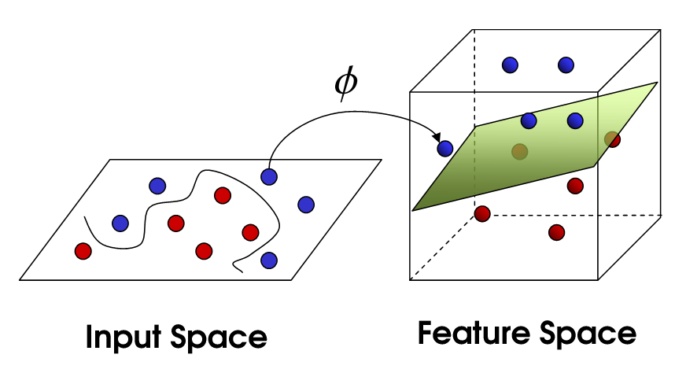
  

    

      <b>This image shows how the kernel trick works for SVMs [2]. </b>
    

  

### Example of Mapping 2D Points with a Polynomial Kernel

The example below showcases how mapping 2D points into a six-dimensional space works in the case of a polynomial kernel: 

  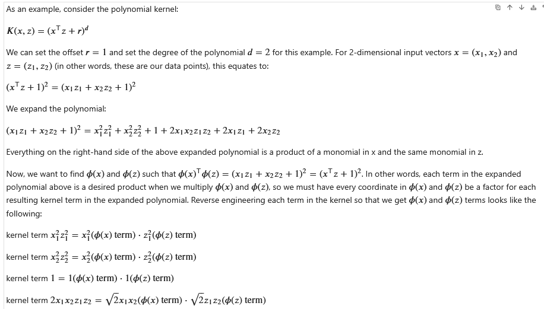
  

    

      <b></b>
    

  

  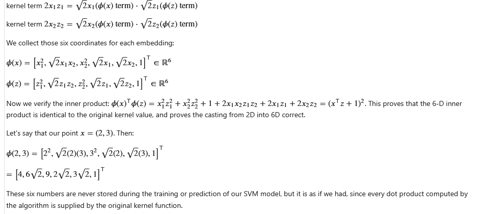
  

    

      <b></b>
    

  

## Data Prep and Code (Data Train-Test-Split Images)

### CODE FOR ALL PROCESSES EXPLAINED BELOW CAN BE FOUND HERE: <a href = "https://github.com/WiHi1131/Machine-Learning-Project/blob/main/code/SVM.ipynb">SVM CODE</a>

To create a SVM model, we will use the same data we already prepared and used for multinomial NB (found <a href = "https://wihi1131.github.io/Machine-Learning-Project/NB">here</a>) This data is suited for the classification task of trying to predict whether players placed in the top four in a given match or not, based on the traits they included in their team composition and how many units of each trait they ran. 

Training and testing datasets were prepared with an 80/20 split, as with all other models. Below are snippets of the training and testing datasets and links to the data used: 

  
  

    

      <b>Training Data. Full Dataset can be found here: <a href = "https://github.com/WiHi1131/Machine-Learning-Project/blob/main/data/svm_training_data.csv">Training Dataset</a></b>
    

  

  
  

    

      <b>Testing Data. Full Dataset can be found here: <a href = "https://github.com/WiHi1131/Machine-Learning-Project/blob/main/data/svm_testing_data.csv">Testing Dataset</a></b>
    

  

## Results and Conclusions

### Data Scaling

Data was scaled using a standard scaler before applying the SVM model. Images of the scaled data are below: 

  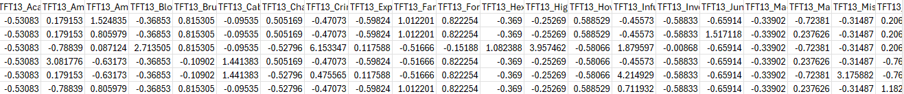
  

    

      <b>Training Data Scaled using sklearn's StandardScaler. Full Dataset can be found here: <a href = "https://github.com/WiHi1131/Machine-Learning-Project/blob/main/data/svm_scaled_training_data.csv">Scaled Training Dataset</a></b>
    

  

  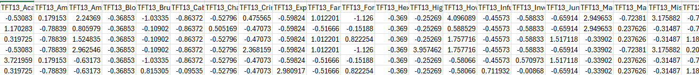
  

    

      <b>Testing Data Scaled using sklearn's StandardScaler. Full Dataset can be found here: <a href = "https://github.com/WiHi1131/Machine-Learning-Project/blob/main/data/svm_scaled_testing_data.csv">Scaled Testing Dataset</a></b>
    

  

### Kernels Used and Model Results: Accuracies and Confusion Matricies

In total, 9 SVM models were created. Three models were created with a polynomial kernel, three with an RBF (Radial Basis Function) kernel, and three with a linear kernel. For each kernel, C, the regularization parameter, was altered between 0.1, 1, and 10. For the polymomial kernel, degree was kept at 2 (so all polymomial models were quadratic), and the coefficient parameter was kept at 1. For the polymomial and rbf kernels, the 'gamma' parameter, another kernel coefficient, was kept as 'scale' (details for each model can be found in the link to the coding notebook above). 

Below are images showing the accuracy, classification report, and confusion matrix for each of the 9 models: 

### Polynomial Kernel, C = 0.1

  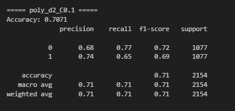
  

    

      <b>The Accuracy and Classification Report of an SVM with a Polynomial Kernel and C = 0.1.</b>
    

  

  
  

    

      <b>The Confusion Matrix of an SVM with a Polynomial Kernel and C = 0.1.</b>
    

  

### Polynomial Kernel, C = 1

  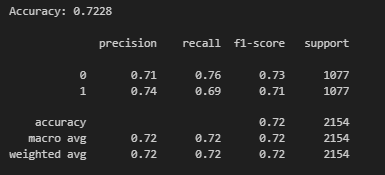
  

    

      <b>The Accuracy and Classification Report of an SVM with a Polynomial Kernel and C = 1.</b>
    

  

  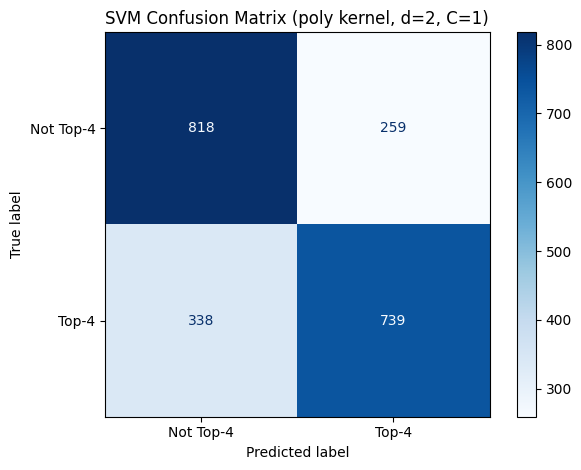
  

    

      <b>The Confusion Matrix of an SVM with a Polynomial Kernel and C = 1.</b>
    

  

### Polynomial Kernel, C = 10

  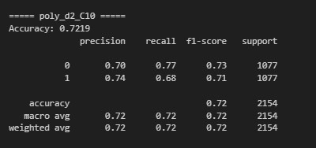
  

    

      <b>The Accuracy and Classification Report of an SVM with a Polynomial Kernel and C = 10.</b>
    

  

  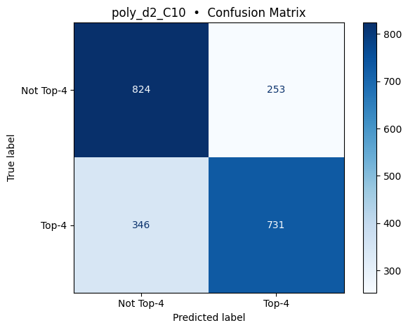
  

    

      <b>The Confusion Matrix of an SVM with a Polynomial Kernel and C = 10.</b>
    

  

### RBF Kernel, C = 0.1

  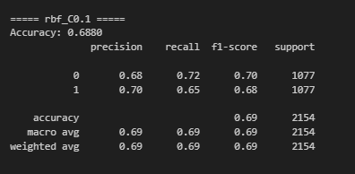
  

    

      <b>The Accuracy and Classification Report of an SVM with an RBF Kernel and C = 0.1.</b>
    

  

  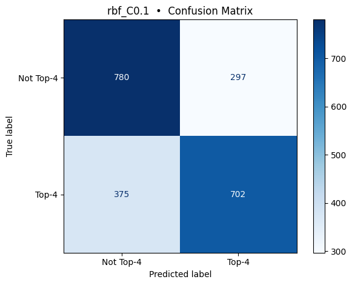
  

    

      <b>The Confusion Matrix of an SVM with an RBF Kernel and C = 0.1.</b>
    

  

### RBF Kernel, C = 1

  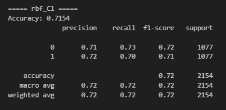
  

    

      <b>The Accuracy and Classification Report of an SVM with an RBF Kernel and C = 1.</b>
    

  

  
  

    

      <b>The Confusion Matrix of an SVM with an RBF Kernel and C = 1.</b>
    

  

### RBF Kernel, C = 10

  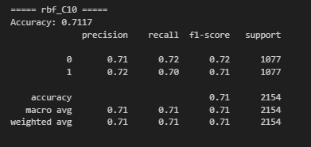
  

    

      <b>The Accuracy and Classification Report of an SVM with an RBF Kernel and C = 10.</b>
    

  

  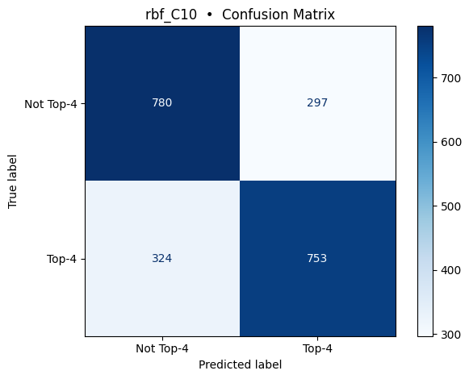
  

    

      <b>The Confusion Matrix of an SVM with an RBF Kernel and C = 10.</b>
    

  

### Linear Kernel, C = 0.1

  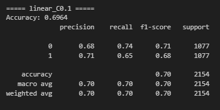
  

    

      <b>The Accuracy and Classification Report of an SVM with a Linear Kernel and C = 0.1.</b>
    

  

  
  

    

      <b>The Confusion Matrix of an SVM with a Linear Kernel and C = 0.1.</b>
    

  

### Linear Kernel, C = 1

  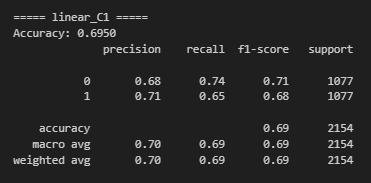
  

    

      <b>The Accuracy and Classification Report of an SVM with a Linear Kernel and C = 0.1.</b>
    

  

  
  

    

      <b>The Confusion Matrix of an SVM with a Linear Kernel and C = 1.</b>
    

  

### Linear Kernel, C = 10

  
  

    

      <b>The Accuracy and Classification Report of an SVM with a Linear Kernel and C = 0.1.</b>
    

  

  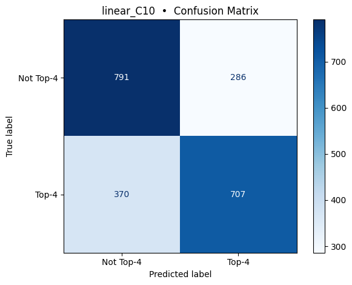
  

    

      <b>The Confusion Matrix of an SVM with a Linear Kernel and C = 10.</b>
    

  

## Sources

-[1]: Lecture 9: SVM. (n.d.). https://www.cs.cornell.edu/courses/cs4780/2018fa/lectures/lecturenote09.html

-[2]: Jain, A. (2024, November 16). SVM kernels and its type - Abhishek Jain - Medium. Medium. https://medium.com/@abhishekjainindore24/svm-kernels-and-its-type-dfc3d5f2dcd8

-[3]: Kernel Methods. (n.d.-b). https://cseweb.ucsd.edu/~dasgupta/250B/kernel-handout.pdf

<a href = "https://wihi1131.github.io/Machine-Learning-Project/">Home</a>

